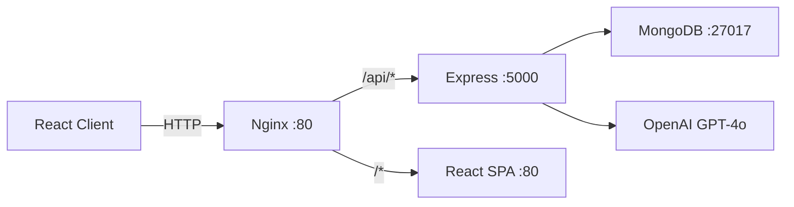

# TicketAI — AI-Powered Jira Ticket Generator

TicketAI is a full-stack web application that uses OpenAI GPT-4o to transform raw, unstructured bug descriptions into fully-formed, professional Jira tickets in seconds. Engineers paste a quick description of the problem, and TicketAI returns a structured ticket complete with a title, description, acceptance criteria, reproduction steps, test cases, severity classification, and effort estimates.

---

## Features

- **AI Ticket Generation** — GPT-4o converts freeform bug descriptions into structured Jira-ready tickets
- **Structured Output** — Every ticket includes title, description, priority, severity, steps to reproduce, acceptance criteria, and test cases
- **Ticket History** — Browse, search, filter, and revisit all previously generated tickets
- **Analytics Dashboard** — Visualize ticket distribution by priority, type, environment, and creation trends over time
- **Dark Mode** — System-aware theme toggle with persistent user preference via Zustand
- **JWT Authentication** — Secure access and refresh token pair; protected routes on both client and server
- **Rate Limiting** — Per-IP rate limiting on the API and stricter limits on auth endpoints
- **Full Audit Log** — Every API action and AI interaction is logged for traceability
- **Docker-First** — Full containerised development and production stack with a single compose command
- **CI/CD Pipeline** — GitHub Actions workflow for linting, testing, Docker builds, and production deployment

---

## Architecture

```
┌──────────────────────────────────────────────────────────────────┐
│  Browser (React 18 + Vite + Tailwind + React Query + Zustand)    │
└────────────────────────┬─────────────────────────────────────────┘
                         │ HTTP / WebSocket
                         ▼
┌──────────────────────────────────────────────────────────────────┐
│  Nginx (Reverse Proxy — port 80)                                  │
│   /api/*  ──────────────────────────► Express API (port 5000)    │
│   /*      ──────────────────────────► React SPA  (port 80)       │
└─────────────────────────────────┬────────────────────────────────┘
                                  │
                    ┌─────────────┴──────────────┐
                    ▼                            ▼
        ┌─────────────────────┐     ┌────────────────────────┐
        │  MongoDB 7           │     │  OpenAI API (GPT-4o)   │
        │  (auth + tickets +  │     │  Prompt → Structured   │
        │   logs)             │     │  JSON ticket output    │
        └─────────────────────┘     └────────────────────────┘
```



---

## Tech Stack

| Layer       | Technology                                                         |
|-------------|--------------------------------------------------------------------|
| Frontend    | React 18, Vite 5, Tailwind CSS 3, React Query v5, Zustand 4       |
| Forms       | React Hook Form, Zod, @hookform/resolvers                          |
| Charts      | Recharts                                                           |
| Backend     | Node.js 20, Express.js 4, JWT (jsonwebtoken), bcryptjs             |
| Validation  | express-validator, Joi                                             |
| Database    | MongoDB 7, Mongoose 8                                              |
| AI          | OpenAI SDK v4 (GPT-4o)                                             |
| Logging     | Winston, Morgan                                                    |
| Testing     | Jest + Supertest (backend), Vitest + Testing Library (frontend)    |
| DevOps      | Docker, Docker Compose, Nginx, GitHub Actions                      |

---

## Project Structure

```
ai-jira-ticket-generator/
├── client/                     # React + Vite frontend
│   ├── src/
│   │   ├── components/         # Reusable UI components
│   │   ├── pages/              # Route-level page components
│   │   ├── hooks/              # Custom React hooks
│   │   ├── stores/             # Zustand state stores
│   │   ├── services/           # Axios API client modules
│   │   └── utils/              # Helpers and formatters
│   ├── Dockerfile
│   ├── nginx.conf              # SPA nginx config (inside container)
│   └── package.json
│
├── server/                     # Node.js + Express backend
│   ├── config/                 # Database and app configuration
│   ├── controllers/            # Route handler functions
│   ├── middleware/             # Auth, rate limit, error handlers
│   ├── models/                 # Mongoose schemas
│   ├── prompts/                # OpenAI prompt templates
│   ├── repositories/           # Data access layer (DB queries)
│   ├── routes/                 # Express router definitions
│   ├── services/               # Business logic and AI integration
│   ├── tests/                  # Jest test suites
│   ├── utils/                  # Shared utilities (logger, etc.)
│   ├── validators/             # Input validation schemas
│   ├── index.js                # Application entry point
│   ├── .env.example            # Environment variable template
│   ├── .eslintrc.js
│   └── Dockerfile
│
├── nginx/
│   └── nginx.conf              # Reverse proxy config (host-level)
│
├── docs/
│   ├── SYSTEM_DESIGN.md
│   ├── API_FLOW.md
│   ├── DATABASE_DESIGN.md
│   └── AI_WORKFLOW.md
│
├── .github/
│   └── workflows/
│       ├── ci.yml              # Lint → Test → Docker build check
│       └── deploy.yml          # Build → Push → SSH deploy
│
├── docker-compose.yml          # Development environment
├── docker-compose.prod.yml     # Production environment
└── README.md
```

---

## Quick Start

### Prerequisites

- **Node.js** 20 or higher (`node --version`)
- **Docker** and **Docker Compose** (`docker --version`)
- An **OpenAI API key** with GPT-4o access

---

### Option 1: Local Development (without Docker)

```bash
# 1. Clone the repository
git clone https://github.com/your-org/ai-jira-ticket-generator.git
cd ai-jira-ticket-generator

# 2. Install backend dependencies
cd server
npm install

# 3. Configure backend environment variables
cp .env.example .env
# Edit .env — at minimum set OPENAI_API_KEY and MONGODB_URI

# 4. Start backend (requires a running MongoDB instance)
npm run dev
# API is now available at http://localhost:5000

# 5. In a new terminal, install and start the frontend
cd ../client
npm install
npm run dev
# Frontend is now available at http://localhost:5173
```

---

### Option 2: Docker (Recommended)

```bash
# 1. Clone the repository
git clone https://github.com/your-org/ai-jira-ticket-generator.git
cd ai-jira-ticket-generator

# 2. Configure environment variables
cp server/.env.example server/.env
# Open server/.env and set at minimum:
#   OPENAI_API_KEY=sk-...
#   JWT_SECRET=<random 64-char string>
#   JWT_REFRESH_SECRET=<another random 64-char string>

# 3. Start all services
docker-compose up -d

# 4. Stream logs (optional)
docker-compose logs -f

# 5. Stop all services
docker-compose down
```

| Access Point          | URL                          |
|-----------------------|------------------------------|
| Full app via Nginx    | http://localhost             |
| Frontend direct       | http://localhost:3000        |
| Backend API direct    | http://localhost:5000        |
| MongoDB (dev only)    | mongodb://localhost:27017    |

---

## Environment Variables

Configure these in `server/.env` (copy from `server/.env.example`):

| Variable               | Required | Description                                         | Example                           |
|------------------------|----------|-----------------------------------------------------|-----------------------------------|
| `PORT`                 | No       | Port the Express server listens on                  | `5000`                            |
| `NODE_ENV`             | Yes      | Runtime environment                                 | `development` / `production`      |
| `MONGODB_URI`          | Yes      | MongoDB connection string                           | `mongodb://localhost:27017/ticketai` |
| `JWT_SECRET`           | Yes      | Secret for signing access tokens (min 32 chars)     | `your-super-secret-key`           |
| `JWT_REFRESH_SECRET`   | Yes      | Secret for signing refresh tokens (min 32 chars)    | `your-refresh-secret-key`         |
| `JWT_EXPIRES_IN`       | No       | Access token TTL                                    | `15m`                             |
| `JWT_REFRESH_EXPIRES_IN` | No     | Refresh token TTL                                   | `7d`                              |
| `OPENAI_API_KEY`       | Yes      | OpenAI API key with GPT-4o access                   | `sk-proj-...`                     |
| `OPENAI_MODEL`         | No       | Model to use for generation                         | `gpt-4o`                          |
| `OPENAI_MAX_TOKENS`    | No       | Maximum tokens per AI response                      | `4096`                            |
| `CLIENT_URL`           | Yes      | Frontend URL for CORS whitelist                     | `http://localhost:3000`           |
| `LOG_LEVEL`            | No       | Winston log level                                   | `info` / `warn` / `error`         |
| `RATE_LIMIT_WINDOW_MS` | No       | Rate limit window in milliseconds                   | `900000` (15 min)                 |
| `RATE_LIMIT_MAX`       | No       | Max requests per window per IP                      | `100`                             |

---

## API Documentation

All endpoints are prefixed with `/api`. Protected routes require the `Authorization: Bearer <token>` header.

### Authentication

| Method | Endpoint                  | Auth | Description                              |
|--------|---------------------------|------|------------------------------------------|
| POST   | `/api/auth/register`      | No   | Create a new user account                |
| POST   | `/api/auth/login`         | No   | Authenticate and receive JWT pair        |
| POST   | `/api/auth/refresh`       | No   | Exchange refresh token for new access token |
| POST   | `/api/auth/logout`        | Yes  | Invalidate current session               |
| GET    | `/api/auth/me`            | Yes  | Get authenticated user profile           |

### Tickets

| Method | Endpoint                  | Auth | Description                              |
|--------|---------------------------|------|------------------------------------------|
| POST   | `/api/tickets/generate`   | Yes  | Generate a ticket from raw description   |
| GET    | `/api/tickets`            | Yes  | List all tickets (paginated, filterable) |
| GET    | `/api/tickets/:id`        | Yes  | Get a single ticket by ID                |
| PATCH  | `/api/tickets/:id`        | Yes  | Update ticket fields                     |
| DELETE | `/api/tickets/:id`        | Yes  | Soft-delete a ticket                     |

### Analytics

| Method | Endpoint                  | Auth | Description                              |
|--------|---------------------------|------|------------------------------------------|
| GET    | `/api/analytics/summary`  | Yes  | Aggregate counts by status, priority, type |
| GET    | `/api/analytics/trends`   | Yes  | Ticket creation trends over time         |

### Health

| Method | Endpoint       | Auth | Description              |
|--------|----------------|------|--------------------------|
| GET    | `/api/health`  | No   | Service health check     |

#### Example: Generate a Ticket

**Request:**
```bash
curl -X POST http://localhost:5000/api/tickets/generate \
  -H "Authorization: Bearer <your_token>" \
  -H "Content-Type: application/json" \
  -d '{
    "rawInput": "Login button doesnt work on mobile safari when user has dark mode enabled. Tapping the button does nothing.",
    "environment": "production",
    "browser": "Safari 17",
    "device": "iPhone 15 Pro"
  }'
```

**Response (200 OK):**
```json
{
  "success": true,
  "data": {
    "_id": "665f1a2b3c4d5e6f7a8b9c0d",
    "title": "[BUG] Login button unresponsive on Mobile Safari with Dark Mode enabled",
    "description": "Users on iPhone with dark mode enabled cannot log in via Safari 17...",
    "stepsToReproduce": ["Enable dark mode on iPhone 15 Pro", "Navigate to the login page in Safari 17", "Tap the login button"],
    "acceptanceCriteria": ["Login button responds to tap events in Safari 17 with dark mode enabled", "..."],
    "testCases": [{ "scenario": "Tapping login with dark mode on", "expectedResult": "User is authenticated and redirected", "testType": "functional" }],
    "priority": "High",
    "severity": "Major",
    "type": "Bug",
    "status": "Open",
    "environment": "production",
    "browser": "Safari 17",
    "device": "iPhone 15 Pro",
    "effortEstimate": "3",
    "labels": ["mobile", "safari", "dark-mode", "login"],
    "createdAt": "2024-06-04T10:30:00.000Z"
  }
}
```

---

## Testing

```bash
# Backend — run all tests with coverage
cd server
npm test

# Backend — watch mode during development
npm run test:watch

# Frontend — run tests once
cd client
npm test

# Frontend — interactive watch mode
npm test -- --watch
```

Test reports are generated in:
- `server/coverage/` — Istanbul/lcov coverage for backend
- Frontend coverage output controlled by Vitest config

---

## Docker Commands

```bash
# Start all services (detached)
docker-compose up -d

# Start and rebuild images
docker-compose up -d --build

# Stop all services (preserve volumes)
docker-compose down

# Stop all services and remove volumes (wipes MongoDB data)
docker-compose down -v

# Stream logs from all services
docker-compose logs -f

# Stream logs from a specific service
docker-compose logs -f backend

# Restart a single service after code change
docker-compose restart backend

# Open a shell inside the backend container
docker-compose exec backend sh

# Open MongoDB shell
docker-compose exec mongodb mongosh ticketai

# View running containers and health status
docker-compose ps
```

---

## Production Deployment

### Prerequisites on the Production Server

- Docker Engine 24+
- Docker Compose plugin (`docker compose` or `docker-compose`)
- A `.env.prod` equivalent loaded into the shell or passed via docker-compose

### Steps

```bash
# 1. SSH into your production server
ssh user@your-server.com

# 2. Clone the repository
git clone https://github.com/your-org/ai-jira-ticket-generator.git
cd ai-jira-ticket-generator

# 3. Create production environment file
# (never commit this file — add to .gitignore)
nano .env.prod
# Set all required variables including MONGO_ROOT_USERNAME, MONGO_ROOT_PASSWORD,
# JWT_SECRET, JWT_REFRESH_SECRET, OPENAI_API_KEY, CLIENT_URL, DOCKER_USERNAME

# 4. Pull and start production services
docker-compose -f docker-compose.prod.yml pull
docker-compose -f docker-compose.prod.yml up -d --remove-orphans

# 5. Verify services are healthy
docker-compose -f docker-compose.prod.yml ps

# 6. View logs
docker-compose -f docker-compose.prod.yml logs -f
```

### GitHub Actions Automated Deployment

Set the following secrets in your GitHub repository (Settings → Secrets → Actions):

| Secret               | Description                               |
|----------------------|-------------------------------------------|
| `DOCKER_USERNAME`    | Docker Hub username                       |
| `DOCKER_PASSWORD`    | Docker Hub password or access token       |
| `PRODUCTION_HOST`    | Production server IP or hostname          |
| `PRODUCTION_USER`    | SSH username                              |
| `PRODUCTION_SSH_KEY` | Private SSH key (RSA or Ed25519)          |
| `PRODUCTION_PATH`    | Absolute path to the project on the server |

Every push to `main` will automatically build, push, and deploy the new images.

---

## Database Schema

TicketAI uses MongoDB with four collections: `users`, `tickets`, `ai_logs`, and `activity_logs`.

Full schema details, indexing strategy, and data relationships are documented in [docs/DATABASE_DESIGN.md](docs/DATABASE_DESIGN.md).

---

## AI Integration

TicketAI uses a carefully engineered system prompt paired with structured JSON output enforcement to ensure reliable, parseable responses from GPT-4o. The pipeline includes input validation, prompt construction, API call with exponential backoff retry, response parsing, field validation, and database persistence.

Full details including sample interactions are documented in [docs/AI_WORKFLOW.md](docs/AI_WORKFLOW.md).

---

## Security Features

- **JWT Authentication** — Short-lived access tokens (15m) paired with long-lived refresh tokens (7d)
- **Password Hashing** — bcrypt with configurable salt rounds (default: 12)
- **Rate Limiting** — express-rate-limit on all `/api/*` routes; stricter limits on auth endpoints
- **Helmet** — Sets 15+ security-related HTTP headers (CSP, HSTS, etc.)
- **CORS** — Whitelist-based cross-origin policy; only the configured CLIENT_URL is allowed
- **Input Validation** — All request bodies validated with express-validator / Joi before reaching controllers
- **Non-root Docker** — Backend container runs as the built-in `node` user, not root
- **Secret Management** — No secrets in code or Docker images; always injected via environment variables

---

## Roadmap

- [ ] **Direct Jira Integration** — Push generated tickets to Jira projects via the Jira REST API
- [ ] **OAuth 2.0 Login** — Google and GitHub social login via Passport.js
- [ ] **Team Collaboration** — Workspaces with shared ticket history and role-based access control
- [ ] **Slack Notifications** — Post generated tickets to a Slack channel via Incoming Webhooks
- [ ] **Ticket Templates** — Pre-configured prompt templates per project or team
- [ ] **Bulk Generation** — Upload a CSV of bug descriptions and generate tickets in batch
- [ ] **AI Fine-Tuning** — Allow teams to train a custom model on their historical ticket data
- [ ] **Export** — Download tickets as CSV, Markdown, or Jira-compatible XML

---

## License

This project is licensed under the **MIT License** — see the [LICENSE](LICENSE) file for details.
